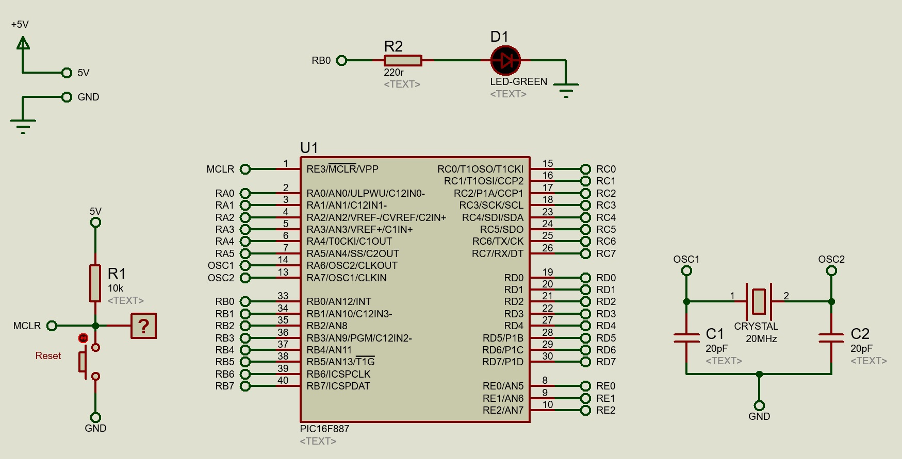
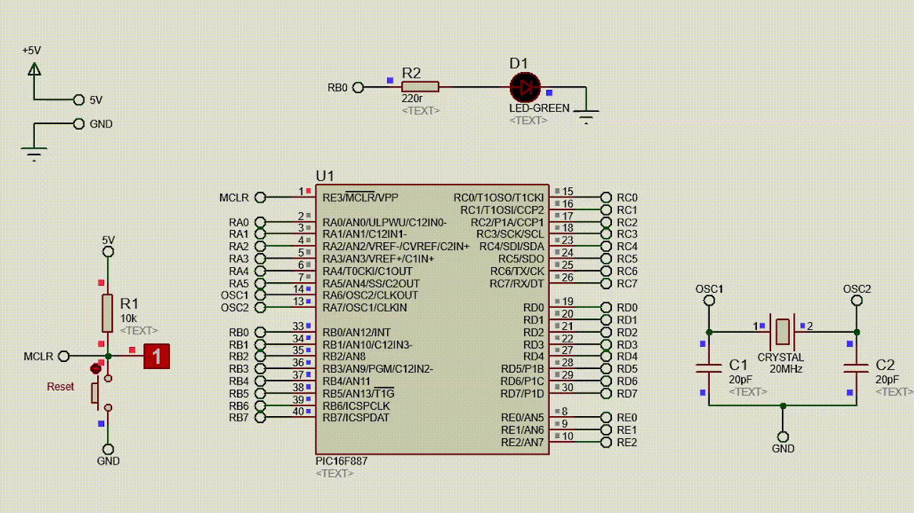

English | [Portuguese](https://github.com/matheussantanads/microcontroladores/blob/main/01_Blink/README_ptbr.md)

# Experiment
Blink an LED every 0.5s. See the code in ```Blink.c```.

# Configurations
- **MCU Clock Frequency:** 20MHz
    ## Bits or Fuses
    - **Oscillator Selection:** HS
    - **Watchdog Timer:** Disabled
    - **Power-up Timer:** Disabled
    - **RE3/MCLR pin function select:** Enabled
    - **Code Protection:** Program memory code protection is disabled
    - **Data Code Protection:** Data memory code protection is disabled
    - **Brown Out Reset-Selection:** Enabled
    - **Internal External Switchover:** Enabled
    - **Fail-Safe Clock Monitor:** Enabled
    - **Low Voltage Programming:** Disabled
    - **In-Circuit Debugger Mode:** Disabled
    - **Brown-out Reset-Selection:** Brown-out Reset set to 4.0V
    - **Flash Program Memory Self-Write:** Disabled

# Schematic


# Simulation

