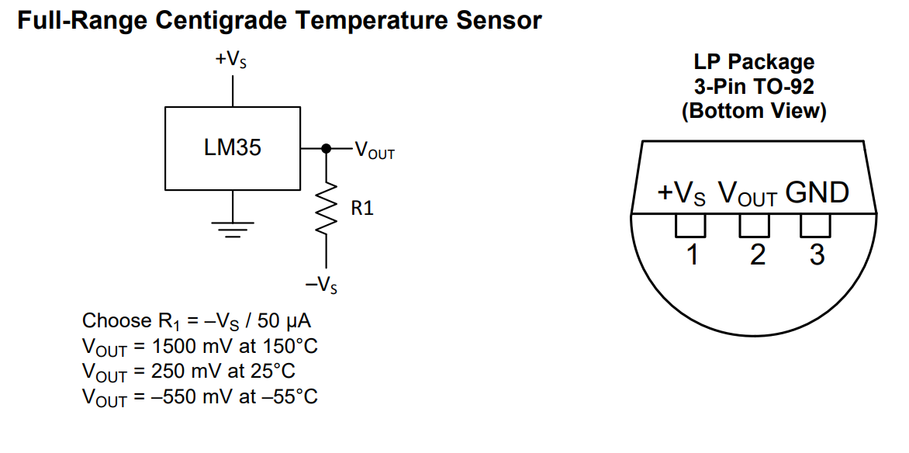
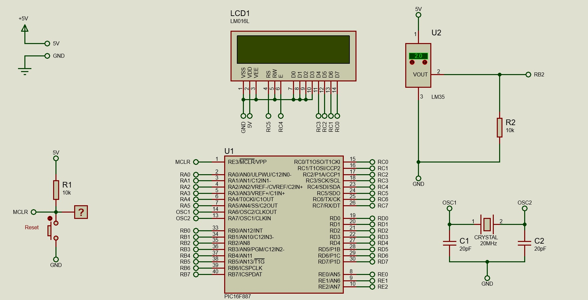
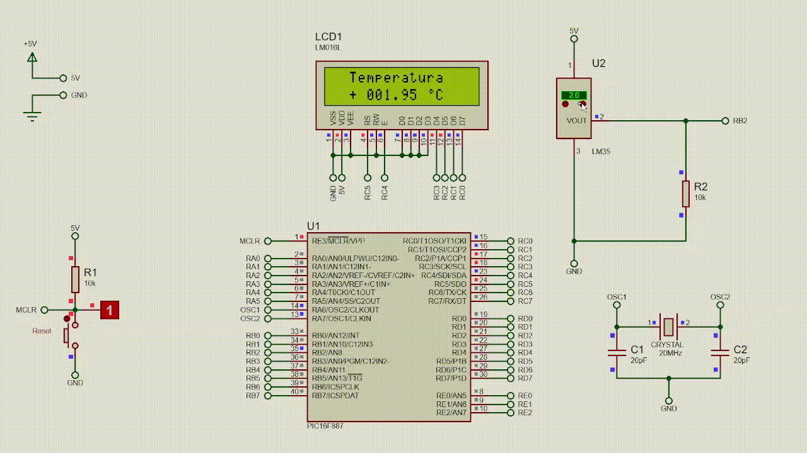
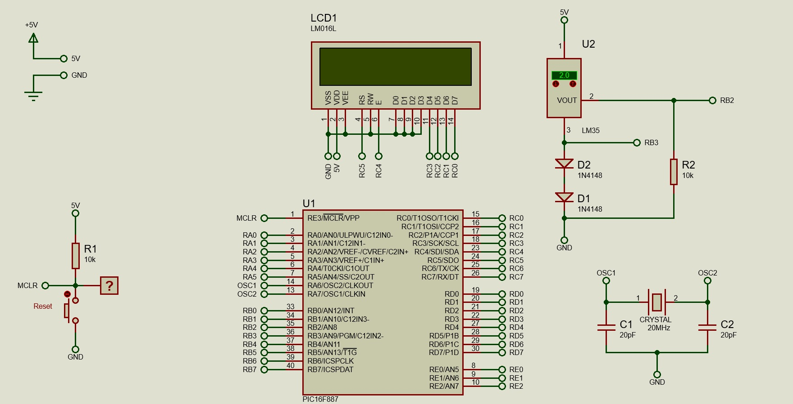
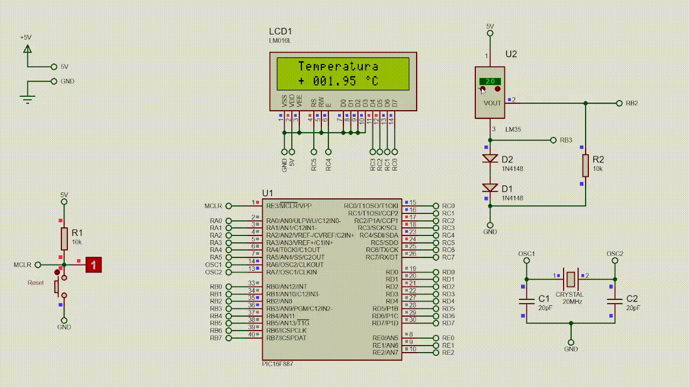

# Analog
Esse projeto tem como objetivo ensinar a ler um canal analógico sem o uso da biblioteca `ADC`. Conectado a porta B no bit 2 e 3 iremos ler os valores enviados pelo sensor LM35 de forma que o utilizaremos em seu range máximo de -55ºC a 150ºC.

- [Bibliotecas necessárias](#bibliotecas-necessárias)
- [Configurações](#configurações)
- [Esquemático para temperaturas entre 0ºC e 150ºC](#esquemático-0ºc-a-150ºc)
- [Simulação para temperaturas entre 0ºC e 150ºC](#simulação-0ºc-a-150ºc)
- [Esquemático para temperaturas entre -55ºC e 150ºC](#esquemático--55ºc-a-150ºc)
- [Simulação para temperaturas entre -55ºC e 150ºC](#simulação--55ºc-a-150ºc)
- [Explicando o Código](#explicando-o-código)
- [Observações](#observações)

## Bibliotecas necessárias
- Lcd
- Lcd_Constants

## Configurações
- **MCU Clock Frequency:** 20MHz
    ### Bits ou Fusíveis
    - **Oscillator Selection:** HS
    - **Watchdog Timer:** Disabled
    - **Power-up Timer:** Disabled
    - **RE3/MCLR pin function select:** Enabled
    - **Code Protection:** Program memory code protection is disabled
    - **Data Code Protection:** Data memory code protection is disabled
    - **Brown Out Reset-Selection:** Enabled
    - **Internal External Switchover:** Enabled
    - **Fail-Safe Clock Monitor:** Enabled
    - **Low Voltage Programming:** Disabled
    - **In-Circuit Debugger Mode:** Disabled
    - **Brown-out Reset-Selection:** Brown-out Reset set to 4.0V
    - **Flash Program Memory Self-Write:** Disabled

## Normalização no sinal do LM35
O sinal do LM35 é um sinal analógico. O PIC16F887 lê/interpreta um sinal analógico com 1024 níveis onde o nível mais baixo representa $0V$ e o nível mais alto representa o VDD.

>Se seu PIC está sendo alimentado com $5V$, então quando ele receber um sinal analógico, este estará sendo avaliado entre $0V$ e $5V$.


*Encapsulamento mais comum do LM35*

Consultando o [datasheet do LM35](https://www.ti.com/lit/ds/symlink/lm35.pdf), já na página 1 é possível ver que o sinal enviado pelo LM35 é de $0,01V/ºC$, ou seja, quando o LM35 estiver medindo 150ºC ele terá um sinal de 1,5V e quando estiver medindo -55ºC ele terá um sinal de $-0,55V$.

Sabendo disso, vamos analisar qual será a faixa que o LM35 irá nos entregar no sinal analógico


$$\begin{array}{cc}
\begin{array}{ccc}
\text{Tensão (V)}&\text{Nível analógico}\\
5&1023\\
-0,55&x
\end{array}
&
\begin{array}{ccc}
\text{Tensão (V)}&\text{Nível analógico}\\
5&1023\\
1,5&x
\end{array}
\\\\
x = \dfrac{1023 \cdot -0,55}{5}= -112,53 & x = \dfrac{1023 \cdot 1,5}{5}=306,9 \approx 307
\end{array}$$

O canal analógico não recebe sinais negativos então vamos receber somente 0 a 307, ou seja, apenas a faixa positiva da temperatura. [Mas e a medição de temperaturas abaixo de 0ºC?](#medindo-temperaturas-abaixo-de-0ºc).

Para normalizar a tensão do LM35 em realção aos níveis analógicos faremos
$$ V_{\text{norm}}=S \cdot \dfrac{5}{1023} $$
Com $S$ sendo o valor analógico (0 até 307) enviado pelo LM35 ao PIC. Sabendo que o LM35 envia $0,01V$ para cada 1ºC teremos então

$$\begin{array}{ccc}
\text{Tensão (V)}&\text{Temperatura (ºC)}\\
0,01&1\\
V_{\text{norm}}&T
\end{array}$$

$$ T = \dfrac{V_{\text{norm}}}{0,01} = \dfrac{S \cdot \dfrac{5}{1023}}{0,01}=S \cdot \dfrac{\dfrac{5}{1023}}{0,01} $$

### Vamos testar

Qual será a temperatura se o LM35 estiver enviando um sinal $S=306,9$?

$$ T=306,9 \cdot \dfrac{\dfrac{5}{1023}}{0,01}=150ºC $$

Perceba que essa equação só vale para $T \geq 0ºC$, uma vez que $S$ não pode ser negativo, ou seja, não recebemos um valor analógico negativo.

## Esquemático 0ºC a 150ºC


## Simulação 0ºC a 150ºC


## Medindo temperaturas abaixo de 0ºC

Para isso uma alternativa é utilizar outro canal analógico para que possamos comparar e assim somar os sinais dos canais de forma que

$$ V_{\text{norm}}=(S_1 - S_2) \cdot \dfrac{\dfrac{5}{1023}}{0,01} $$

Com $S_1$ sendo o sinal analógico referente ao $V_{out}$ do LM35 (o mesmo que utilizamos na equação somente para valores positivos) e $S_2$ sendo o sinal analógico referente ao pino GND do LM35 com diodos, pois nesse trecho do circuito teremos um DDP de 0,55V quando a temperatura está em -55ºC. Com isso ganhamos então a medição do lado negativo.

## Esquemático -55ºC a 150ºC


## Simulação -55ºC a 150ºC


## Explicando o código

>Configuração dos bits para o LCD
>```c
>sbit LCD_RS at RC5_bit;
>```
>$\vdots$
>```
>sbit LCD_D7_Direction at TRISC0_bit;
>```

<br/>

>As próximas 3 linhas do código diz respeito a definições para que possamos criar a nossa propria função de leitura e inicialização do ADC. Pode-se também não utilizar o que iremos fazer e apenas utilizar uma biblioteca `ADC` e daí essas 3 declarações não se fazem necessárias.
>
>> Habilita o módulo ADC. Veja mais disso no [datasheet do PIC16F887](https://ww1.microchip.com/downloads/aemDocuments/documents/OTH/ProductDocuments/DataSheets/40001291H.pdf) na página 104.<br/>
>>
>>```c
>>#define SBIT_ADON 0
>>```
>
>> Define a quantidade de bits do canal que iremos deslocar
>>
>>```c
>>#define SBIT_CHS0 2
>>```
>
>> O resultado da conversão será justificado a esquerda, a tensão de referência negativa será o pino VREF-, a tensão de referência positiva será o pino VREF+. Lembrando que $7_{10}$ = $111_{2}$. Veja mais disso no [datasheet do PIC16F887](https://ww1.microchip.com/downloads/aemDocuments/documents/OTH/ProductDocuments/DataSheets/40001291H.pdf) na página 105.<br/>
>>
>>```c
>>#define SBIT_ADFM 7
>>```

<br/>

> A variável `degreeCharacter` será utilizada para exibir o símbolo de º no display.

<br/>

> Configura os bits 2 e 3 da Porta B como entrada.
>```c
>TRISB2_bit = 1;
>TRISB3_bit = 1;
>```

<br/>

> Configura os bits 2 e 3 da Porta B como analógicos que são respectivamente os canais 8 e 9.
>```c
>ANSELH.ANS8 = 1;
>ANSELH.ANS9 = 1;
>```

<br/>

> Configura o LCD

<br/>

> Inicializa o módulo ADC.
>
>```c
>ADC_Init();
>```

<br/>

> Calcula a temperatura de acordo com o que foi visto [aqui](#medindo-temperaturas-abaixo-de-0ºc).
>
>```c
>temperatura = ((int)ADC_Read(8) - (int)ADC_Read(9))*(5.0f/1023.0f/0.01f);
>```

<br/>

> Exibe o sinal de + ou - da temperatura no display.
>
>```c
>if(temperatura < 0){
>    LCD_OUT(2,3,"-");
>}else{
>    LCD_OUT(2,3,"+");
>}
>```

<br/>

> Separa os dígitos da temperatura e exibe no display
>
>```c
>separarDigitos(temperatura,&centena,&dezena,&unidade,&decimal1,&decimal2);
>
>LCD_CHR(2,5,centena +48); // +48 serve para que o número inteiro esteja dentro da tabela ASCII onde 48 representa 0.
>LCD_CHR_CP(dezena +48);
>LCD_CHR_CP(unidade +48);
>LCD_CHR_CP('.');
>LCD_CHR_CP(decimal1 +48);
>LCD_CHR_CP(decimal2 +48);
>
>CustomChar(2,12); // é utilizado para exibir o símbolo de º
>LCD_OUT(2,13,"C");
>

<br/>

> **FUNÇÕES**
>
>>```c
>> Inicializa o ADC
>>
>>void ADC_Init(){
>>    ADCON0 = 0x80; // 0b10000000 Configura o clock para Fosc/32
>>    ADCON1 = (1<<SBIT_ADFM); //Desloca os bits para esquerca em ADCON1
>>}
>>```
>
>> Coleta/Lê a informação do canal escolhido
>>```c
>>unsigned int ADC_Read(unsigned char canal) {
>>    ADCON0 = (1<<SBIT_ADON) | (canal<<SBIT_CHS0);
>>    Delay_us(20);
>>    GO_bit = 1; // Inicia a conversão
>>    while(GO_bit == 1); // Quando a conversão termina essa condição é insatisfeita
>>    return((ADRESH<<8) | ADRESL);
>>}
>>```
>
>>```c
>> Recebe um número entre -9999.99 e +9999.99 e separa a centena, dezena, unidade e as 2 primeiras casas decimais, o milhar não entra nessa separação. Essa separação de dígitos é feita baseada no algoritmo da divisão.
>>
>>void separarDigitos(float temp, int *cent, int *dezn, int *und, int *dec1, int *dec2){
>>    
>>    if(temp < 0){
>>        temp = temp *-1; //Garante que o valor será sempre positivo
>>    } 
>>    //Sempre positivo pois o sinal o display já coletou
>>    *cent = (((int)(temp/100))%10);
>>    *dezn = (((int)(temp/10))%10);
>>    *und  = (((int)(temp/1))%10);
>>    *dec1 = ((((int)(temp*100))%100)/10);
>>    *dec2 = (((int)((((int)(temp*100))%100)/1))%10);
>>}
>>```
>
>> Exibe o símbolo de º no display
>>```c
>> void CustomChar(char pos_row, char pos_char){
>>     char i;
>>     Lcd_Cmd(64);
>>     for (i = 0; i<=7; i++) LCD_CHR_CP(degreeCharacter[i]);
>>     Lcd_Cmd(_LCD_RETURN_HOME);
>>     LCD_CHR(pos_row, pos_char, 0);
>> }
>> ```

## Observações
Se for utilizar a biblioteca `ADC` então não precisa declarar as variáveis

```c
#define SBIT_ADON 0
#define SBIT_CHS0 2
#define SBIT_ADFM 7
```

E também não precisa declarar as funções

```c
void ADC_Init(){}
unsigned int ADC_Read(unsigned char canal){}
```

Na biblioteca existe função de mesmo nome e mesmo propósito.
