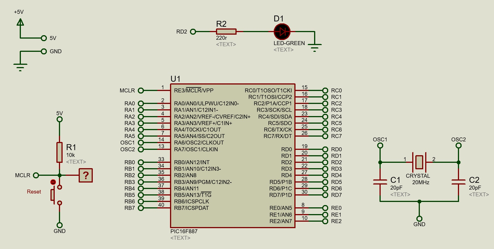
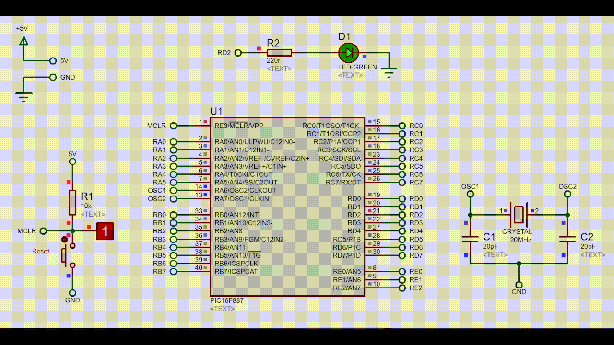

# Blink
Conectado ao pino 21 do microcontrolador o LED deverá piscar a cada 0,5s.

- [Configurações](#configurações)
- [Esquemático](#esquemático)
- [Simulação](#simulação)
- [Explicando o Código](#explicando-o-código)

## Configurações
- **MCU Clock Frequency:** 20MHz
    ### Bits ou Fusíveis
    - **Oscillator Selection:** HS
    - **Watchdog Timer:** Disabled
    - **Power-up Timer:** Disabled
    - **RE3/MCLR pin function select:** Enabled
    - **Code Protection:** Program memory code protection is disabled
    - **Data Code Protection:** Data memory code protection is disabled
    - **Brown Out Reset-Selection:** Enabled
    - **Internal External Switchover:** Enabled
    - **Fail-Safe Clock Monitor:** Enabled
    - **Low Voltage Programming:** Disabled
    - **In-Circuit Debugger Mode:** Disabled
    - **Brown-out Reset-Selection:** Brown-out Reset set to 4.0V
    - **Flash Program Memory Self-Write:** Disabled

## Esquemático


## Simulação


## Explicando o código
>Define uma constante chamada *PIN_LED* que diz em que porta o led está conectado, neste caso é na Porta D no bit RD2 que corresponde ao pino 21 do microcontrolador.
>
>```c
>#define PIN_LED PORTD.RD2
>```


>Configura o bit RD2 como saída.
>```c
>TRISD2_bit = 0;
>```

>Configura o bit RD2 para nível lógico alto ( 1 ), ou seja, ligado.
>```c
>LED_PIN = 1;
>```

>Aguarda 0,5s
>```c
>delay_ms(500);
>```

>Configura o bit RD2 para iniciar em nível lógico baixo ( 0 ), ou seja, desligado.
>```c
>LED_PIN = 0;
>```


Então ficamos nesse loop, desliga o LED, aguarda 0.5s, liga-o novamente, aguarda 0.5s e desliga novamente.


