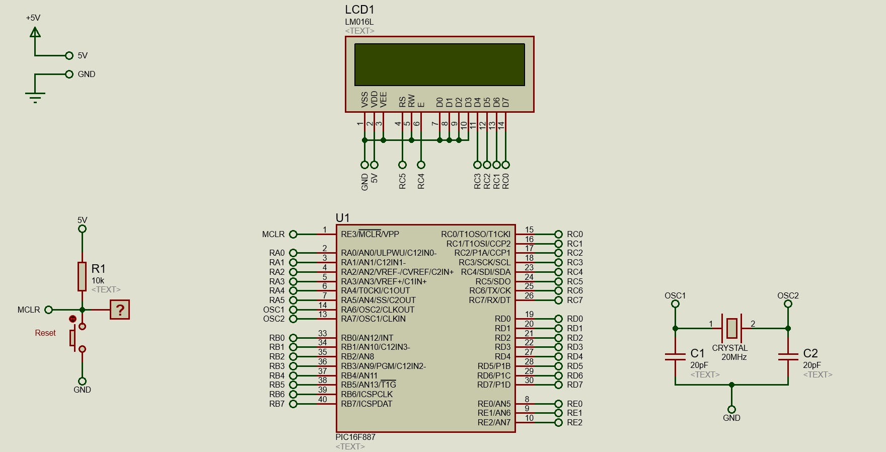
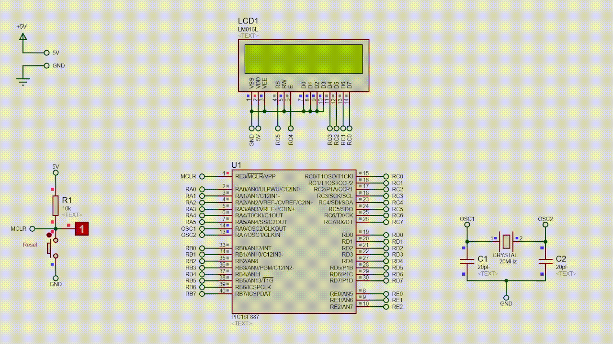

# LCD
Conectado na porta C, vamos exibir a mensagem "Olá Mundo!" centralizada na primeira linha da tela. Para utilizar o LCD iremos importar a biblioteca **Lcd** e **Lcd_Constants**. O MiKroC já possui algumas bibliotecas para importar alguma delas biblioteca basta ir em `View > Library Manager`. Neste caso basta buscar por Lcd e marcar a caixa correspondente.

- [Configurações](#configurações)
- [Esquemático](#esquemático)
- [Simulação](#simulação)
- [Explicando o Código](#explicando-o-código)

## Configurações
- **MCU Clock Frequency:** 20MHz
    ### Bits ou Fusíveis
    - **Oscillator Selection:** HS
    - **Watchdog Timer:** Disabled
    - **Power-up Timer:** Disabled
    - **RE3/MCLR pin function select:** Enabled
    - **Code Protection:** Program memory code protection is disabled
    - **Data Code Protection:** Data memory code protection is disabled
    - **Brown Out Reset-Selection:** Enabled
    - **Internal External Switchover:** Enabled
    - **Fail-Safe Clock Monitor:** Enabled
    - **Low Voltage Programming:** Disabled
    - **In-Circuit Debugger Mode:** Disabled
    - **Brown-out Reset-Selection:** Brown-out Reset set to 4.0V
    - **Flash Program Memory Self-Write:** Disabled

## Esquemático


## Simulação


## Explicando o código

> Define os bits para o LCD.
>```c
>sbit LCD_RS at RC5_bit;
>sbit LCD_RS_Direction at TRISC5_bit;
>
>sbit LCD_EN at RC4_bit;
>sbit LCD_EN_Direction at TRISC4_bit;
>
>sbit LCD_D4 at RC3_bit;
>sbit LCD_D4_Direction at TRISC3_bit;
>
>sbit LCD_D5 at RC2_bit;
>sbit LCD_D5_Direction at TRISC2_bit;
>
>sbit LCD_D6 at RC1_bit;
>sbit LCD_D6_Direction at TRISC1_bit;
>
>sbit LCD_D7 at RC0_bit;
>sbit LCD_D7_Direction at TRISC0_bit;
>```

> Inicializa o LCD.
>```c
>Lcd_Init();
>```

> Limpa o LCD.
>```c
>Lcd_Cmd(_LCD_CLEAR);
>```

> Reseta a posição do cursor no LCD.
>```c
>Lcd_Cmd(_LCD_CURSOR_OFF);
>```

> Exibe a mensagem 'Ola Mundo' na primeira linha a partir da coluna 4 até a 12, caractere por caractere.
>```c
>Lcd_Chr(1,4,'O');
>Lcd_Chr(1,5,'L');
>Lcd_Chr(1,6,'A');
>Lcd_Chr(1,7,' ');
>Lcd_Chr(1,8,'M');
>Lcd_Chr(1,9,'U');
>Lcd_Chr(1,10,'N');
>Lcd_Chr(1,11,'D');
>Lcd_Chr(1,12,'O');
>```

>Aguarda 1s
>```c
>delay_ms(1000);
>```

> Exibe a mensagem 'Ola Mundo' na primeira linha a partir da coluna 4.
>```c
>Lcd_Out(1,4,"OLA MUNDO");
>```

Essas são as formas mais comuns de escrever algo no LCD.